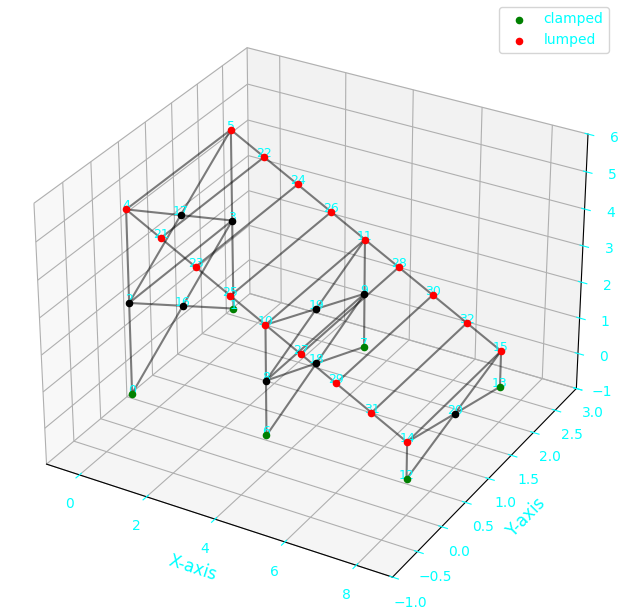

## Table of Contents

1. [Synopsis](#Synopsis)
2. [Key Features](#key-features)
3. [Structure Modeling](#structure-modeling)
4. [Finite Element Code](#finite-element-code)
5. [Transient Response Analysis](#transient-response-analysis)
6. [Model Reduction Methods](#model-reduction-methods)
7. [Acknowledgements](#Acknowledgements)


## Synopsis
In the framework of the Uliege course [MECA0029-1](https://www.programmes.uliege.be/cocoon/20242025/en/cours/MECA0029-1.html), it has been asked to implements a comprehensive Finite Element Analysis (FEM) of three-dimensional structures using Python. It provides a robust framework for modeling, analyzing, and simulating complex structural systems.

## Key Features

- Advanced 3D structure modeling capabilities
- Object-oriented Finite Element solver
- Multiple analysis methods for transient response
- Model reduction techniques for improved computational efficiency
- Comprehensive visualization tools

## Structure Modeling



- Create 3D geometries using beam elements
- Define boundary conditions using clamped nodes
- Add lumped masses to specific nodes for mass distribution

## Finite Element Code

The FEM implementation includes:

- Object-oriented design with `Node` and `Element` classes
- Efficient computation of sparse matrices (K, C, M)
- Eigenvalue solver for natural frequencies and mode shapes
- Convergence analysis with variable element density

## Transient Response Analysis

Analyze the system's response to arbitrary perturbations using:

- Mode Displacement Method
- Mode Acceleration Method
- Newmark Integration Method
- FFT analysis of the response

## Model Reduction Methods

Implement advanced reduction techniques:

- Guyan-Irons Method (static condensation)
- Craig-Bampton Method (component mode synthesis)

## Installation

```bash
git clone https://github.com/Rivlow/theory-of-vibration.git
```

## Acknowledgements
I would like to thank Camille and Louise who helped me a lot during this project !
