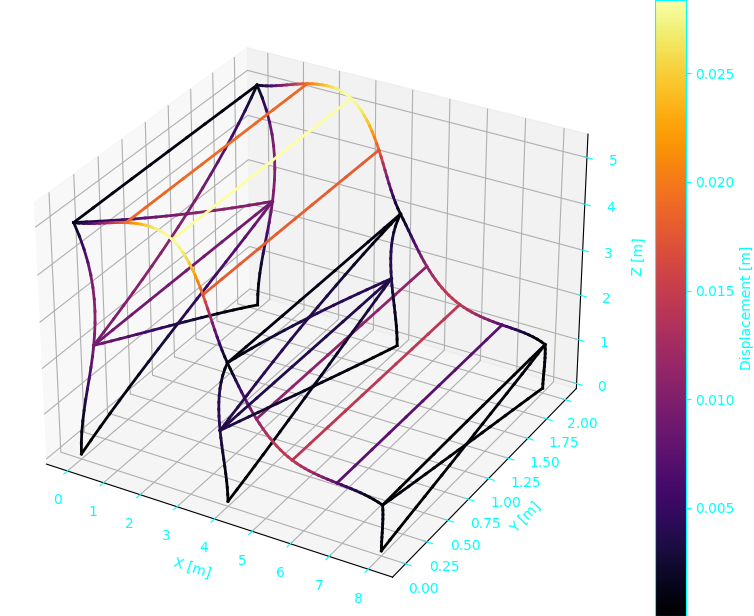
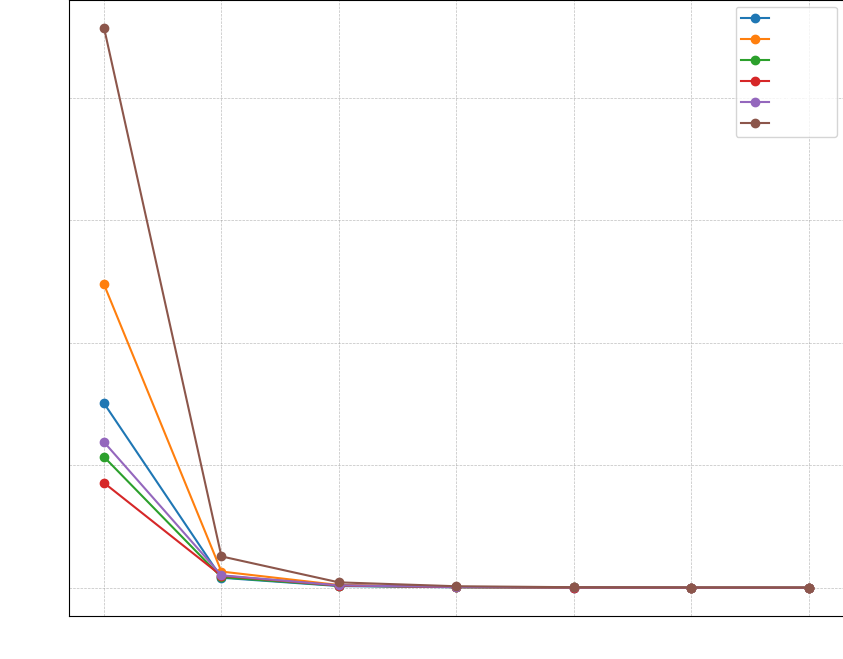

# 3D Structure Finite Element Analysis - Part 1

This part of the project focuses on the eigenvalue problem $\displaystyle \det(\mathbf{K} - \omega^2 \mathbf{M}) = 0$, which involves the assembly of the global stiffness matrix $\mathbf{K}$ and mass matrix $\mathbf{M}$. We also study the convergence of eigenfrequencies by increasing the number of elements per beam.

## Key Features

1. **Structure Modeling**
   - Creation of complex 3D geometry with beam elements
   - Support for various boundary conditions (clamped nodes)
   - Addition of lumped masses on specific nodes

2. **Adaptive Meshing**
   - Capability to increase the number of elements per beam for improved accuracy

3. **Modal Analysis**
   - Computation of global mass and stiffness matrices
   - Solving the eigenvalue problem to obtain natural frequencies and mode shapes

4. **Visualization**
   - Visualization of mode shapes with a color scale based on displacement amplitude
   

5. **Convergence Study**
   - Functionality to study the convergence of results based on the number of elements
   

## Main Modules

- `FEM.py`: Contains `Solver`, `Node`, and `Element` classes for finite element analysis
- `Tools.py`: Utility functions for display and data processing
- `set_parameters.py`: Definition of geometric and physical parameters of the structure
- `main_part1.py`: Main script to run the analysis
- `convergence_part1.py`: Script for convergence study

## Mathematical Formulation

### 1. Local Stiffness Matrix

The local stiffness matrix $\mathbf{K}\_e$ for a beam element is given by:

```math
\mathbf{K}\_e = \begin{bmatrix}
\frac{EA}{l} & 0 & 0 & 0 & 0 & 0 & -\frac{EA}{l} & 0 & 0 & 0 & 0 & 0 \\\
0 & \frac{12EI\_z}{l^3} & 0 & 0 & 0 & \frac{6EI\_z}{l^2} & 0 & -\frac{12EI\_z}{l^3} & 0 & 0 & 0 & \frac{6EI\_z}{l^2} \\\
0 & 0 & \frac{12EI\_y}{l^3} & 0 & -\frac{6EI\_y}{l^2} & 0 & 0 & 0 & -\frac{12EI\_y}{l^3} & 0 & -\frac{6EI\_y}{l^2} & 0 \\\
0 & 0 & 0 & \frac{GJ\_x}{l} & 0 & 0 & 0 & 0 & 0 & -\frac{GJ\_x}{l} & 0 & 0 \\\
0 & 0 & -\frac{6EI\_y}{l^2} & 0 & \frac{4EI\_y}{l} & 0 & 0 & 0 & \frac{6EI\_y}{l^2} & 0 & \frac{2EI\_y}{l} & 0 \\\
0 & \frac{6EI\_z}{l^2} & 0 & 0 & 0 & \frac{4EI\_z}{l} & 0 & -\frac{6EI\_z}{l^2} & 0 & 0 & 0 & \frac{2EI\_z}{l} \\\
-\frac{EA}{l} & 0 & 0 & 0 & 0 & 0 & \frac{EA}{l} & 0 & 0 & 0 & 0 & 0 \\\
0 & -\frac{12EI\_z}{l^3} & 0 & 0 & 0 & -\frac{6EI\_z}{l^2} & 0 & \frac{12EI\_z}{l^3} & 0 & 0 & 0 & -\frac{6EI\_z}{l^2} \\\
0 & 0 & -\frac{12EI\_y}{l^3} & 0 & \frac{6EI\_y}{l^2} & 0 & 0 & 0 & \frac{12EI\_y}{l^3} & 0 & \frac{6EI\_y}{l^2} & 0 \\\
0 & 0 & 0 & -\frac{GJ\_x}{l} & 0 & 0 & 0 & 0 & 0 & \frac{GJ\_x}{l} & 0 & 0 \\\
0 & 0 & -\frac{6EI\_y}{l^2} & 0 & \frac{2EI\_y}{l} & 0 & 0 & 0 & \frac{6EI\_y}{l^2} & 0 & \frac{4EI\_y}{l} & 0 \\\
0 & \frac{6EI\_z}{l^2} & 0 & 0 & 0 & \frac{2EI\_z}{l} & 0 & -\frac{6EI\_z}{l^2} & 0 & 0 & 0 & \frac{4EI\_z}{l}
\end{bmatrix}
```

Where:
- $E$: Young's modulus
- $G$: Shear modulus
- $A$: Cross-sectional area
- $l$: Length of the element
- $I\_y, I\_z$: Second moments of area
- $J\_x$: Torsional constant

### 2. Local Mass Matrix

The local mass matrix $\mathbf{M}\_e$ for a beam element is given by:

```math
\mathbf{M}\_e = \frac{\rho Al}{420} \begin{bmatrix}
140 & 0 & 0 & 0 & 0 & 0 & 70 & 0 & 0 & 0 & 0 & 0 \\\
0 & 156 & 0 & 0 & 0 & 22l & 0 & 54 & 0 & 0 & 0 & -13l \\\
0 & 0 & 156 & 0 & -22l & 0 & 0 & 0 & 54 & 0 & 13l & 0 \\\
0 & 0 & 0 & 140r^2 & 0 & 0 & 0 & 0 & 0 & 70r^2 & 0 & 0 \\\
0 & 0 & -22l & 0 & 4l^2 & 0 & 0 & 0 & -13l & 0 & -3l^2 & 0 \\\
0 & 22l & 0 & 0 & 0 & 4l^2 & 0 & 13l & 0 & 0 & 0 & -3l^2 \\\
70 & 0 & 0 & 0 & 0 & 0 & 140 & 0 & 0 & 0 & 0 & 0 \\\
0 & 54 & 0 & 0 & 0 & 13l & 0 & 156 & 0 & 0 & 0 & -22l \\\
0 & 0 & 54 & 0 & -13l & 0 & 0 & 0 & 156 & 0 & 22l & 0 \\\
0 & 0 & 0 & 70r^2 & 0 & 0 & 0 & 0 & 0 & 140r^2 & 0 & 0 \\\
0 & 0 & 13l & 0 & -3l^2 & 0 & 0 & 0 & 22l & 0 & 4l^2 & 0 \\\
0 & -13l & 0 & 0 & 0 & -3l^2 & 0 & -22l & 0 & 0 & 0 & 4l^2
\end{bmatrix}
```

Where:
- $\rho$: Mass density
- $r$: Radius of gyration

### 3. Transformation to Global Coordinates

To transform the local matrices to global coordinates, we use a transformation matrix $\mathbf{T}$:

$\displaystyle \mathbf{K}\_{e\_g} = \mathbf{T}^T \mathbf{K}\_e \mathbf{T}$
$\displaystyle \mathbf{M}\_{e\_g} = \mathbf{T}^T \mathbf{M}\_e \mathbf{T}$

The transformation matrix $\mathbf{T}$ is constructed using direction cosines:
```math
\mathbf{T} = \begin{bmatrix}
\mathbf{R} & \mathbf{0} & \mathbf{0} & \mathbf{0} \\\
\mathbf{0} & \mathbf{R} & \mathbf{0} & \mathbf{0} \\\
\mathbf{0} & \mathbf{0} & \mathbf{R} & \mathbf{0} \\\
\mathbf{0} & \mathbf{0} & \mathbf{0} & \mathbf{R}
\end{bmatrix}
```

Where $\mathbf{R}$ is the rotation matrix:
```math
\mathbf{R} = \begin{bmatrix}
\cos(\theta_x) & \cos(\theta_y) & \cos(\theta_z) \\\
\cos(\phi_x) & \cos(\phi_y) & \cos(\phi_z) \\\
\cos(\psi_x) & \cos(\psi_y) & \cos(\psi_z)
\end{bmatrix}
```
Here, $\theta$, $\phi$, and $\psi$ represent the angles between the local element axes and the global coordinate axes.

### 4. Assembly of Global Matrices

The global stiffness and mass matrices are assembled by summing the contributions from each element:

 $\displaystyle \mathbf{K} = \sum\_{e=1}^{n\_e} \mathbf{K}\_{e\_g}$
 $\displaystyle \mathbf{M} = \sum\_{e=1}^{n\_e} \mathbf{M}\_{e\_g}$

Where $n\_e$ is the total number of elements in the structure.

### 5. Eigenvalue Problem

The natural frequencies and mode shapes are obtained by solving the eigenvalue problem:

$\displaystyle (\mathbf{K} - \omega^2 \mathbf{M}) \mathbf{\phi} = \mathbf{0}$

Where $\omega$ are the natural frequencies and $\mathbf{\phi}$ are the corresponding mode shapes.
