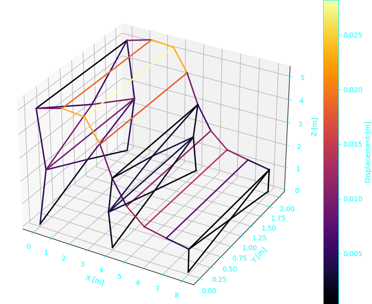
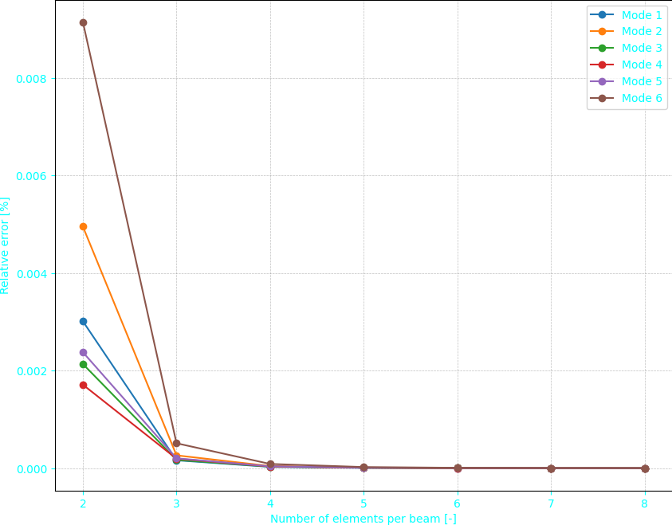

Here's the README description in English for the features of your code (part 1):

# 3D Structure Finite Element Analysis - Part 1

This project implements a Finite Element Analysis (FEM) of a three-dimensional structure using Python. It calculates the natural modes and frequencies of the structure.

## Key Features

1. **Structure Modeling**
   - Creation of a complex 3D geometry with beam elements
   - Support for various boundary conditions (clamped nodes)
   - Addition of lumped masses on specific nodes
   

2. **Adaptive Meshing**
   - Ability to increase the number of elements per beam for improved accuracy

3. **Modal Analysis**
   - Computation of global mass and stiffness matrices
   - Eigenvalue problem solving to obtain natural frequencies and mode shapes

4. **Visualization**
   - 3D display of the structure using matplotlib
   - Representation of clamped nodes and lumped masses
   - Visualization of mode shapes with a color scale based on displacement amplitude
   

5. **Convergence Study**
   - Functionality to study the convergence of results based on the number of elements
   

## Main Modules

- `FEM.py`: Contains `Solver`, `Node`, and `Element` classes for finite element analysis
- `Tools.py`: Utility functions for display and data processing
- `set_parameters.py`: Definition of geometric and physical parameters of the structure
- `main_part1.py`: Main script to run the analysis
- `convergence_part1.py`: Script for convergence study
